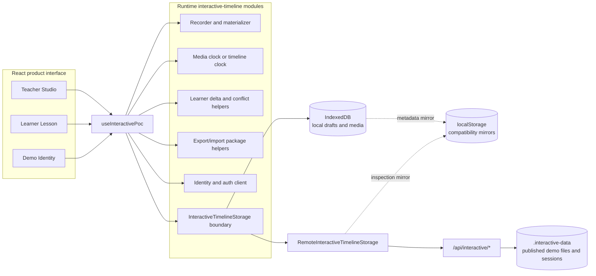

# Thesis architecture summary

## Purpose and system boundary

The thesis prototype adds an interactivity layer to TutorialKit. A teacher records structured editor/file actions and optional narration or webcam media. A learner replays the recording, pauses to edit a separate workspace, and saves file-level work that remains recoverable after teacher playback resumes. The design deliberately keeps immutable teacher artifacts separate from learner-owned state.

The React integration wraps existing workspace/editor callbacks rather than modifying CodeMirror internals. `WorkspacePanel.tsx` connects TutorialKit state to `useInteractivePoc`, while runtime modules under `packages/runtime/src/interactive-timeline/` own recording, materialization, playback timing, storage contracts, learner deltas, conflicts, identity types, and package transfer.

## Architecture diagram



Only `RemoteInteractiveTimelineStorage` performs interactivity-layer `fetch` calls. The Astro middleware implements the local `/api/interactive/*` routes and writes gitignored development data under `.interactive-data/`.

## Teacher Studio flow

1. The teacher signs in using the demo identity panel.
2. Recording captures the initial normalized file snapshot and timestamped `file.opened`, `file.changed`, and `editor.scrolled` events.
3. Optional microphone or webcam media begins from the same local start time and remains an attachment to the structured recording.
4. Stopping creates an in-memory `TeacherRecording`; saving writes a local IndexedDB draft and media blobs.
5. Preview uses the same replay engine as the learner flow.
6. Publishing sends immutable recording JSON and associated media to the development backend. Reposting changed JSON under the same recording id is rejected.
7. Export can package the recording, media, and optionally the current user's learner work without altering the source.

## Learner Lesson flow

1. The learner signs in and opens a published lesson.
2. Playback resets the workspace to `baseFiles` and applies ordered events by `tMs`, then `seq`.
3. **Try It Yourself** pauses the playback source and captures the teacher timestamp.
4. **Save My Work** compares the learner workspace with teacher state materialized at that timestamp and stores only the file-level delta.
5. **Resume Teacher** continues teacher events without deleting the saved delta.
6. **Restore My Work** validates the recording id/version and base-state hash before applying the latest matching learner-owned delta.

## Structured timeline and media attachment model

`TeacherRecording` contains normalized `baseFiles`, ordered `TimelineEvent[]`, duration, ownership fields, and optional media metadata references. Media Blob data is stored separately. This preserves deterministic, inspectable editor replay instead of replacing it with opaque screen video.

When media is available, `HTMLMediaElement.currentTime * 1000` is the single timeline time source. Without media—including an imported package whose media bytes are unavailable—`TimelinePlaybackClock` uses `requestAnimationFrame`. Playback changes use an explicit programmatic-change guard so they are not recorded as teacher or learner edits.

## Local draft storage

`IndexedDBInteractiveTimelineStorage` stores local `teacherRecordings`, `learnerDeltas`, and media `Blob` values. It migrates and mirrors timeline metadata through the compatibility keys:

```text
interactive-poc.teacherRecording
interactive-poc.learnerDeltas
```

Media is never mirrored into localStorage. If IndexedDB is unavailable, timeline-only operations can fall back to `LocalStorageInteractiveTimelineStorage`.

## Published development storage

`RemoteInteractiveTimelineStorage` maps the same async storage seam to `/api/interactive/*`. The Astro development/preview middleware persists recording JSON, learner delta JSON, media metadata/binaries, and sessions under `.interactive-data/`. This file-backed path demonstrates backend boundaries and browser reload recovery; it is not a production database or object store.

## Learner delta model

A `LearnerDelta` stores full contents for `addedOrModified` files and normalized paths for `removed` files. It is keyed by learner, lesson, teacher recording id/version, paused teacher timestamp, and the hash of teacher files at that timestamp. The remote server derives learner ownership from the current session rather than trusting a client-supplied user id. Saving or restoring a delta never mutates the teacher recording.

## Conflict resolution model

Conflict detection compares learner-changed paths with later teacher `file.changed` events. A no-conflict restore stays one click. A conflicted restore requires one explicit choice:

- **Restore My Work Anyway** applies the saved delta;
- **Keep Teacher Version** leaves the visible teacher state;
- **View Conflict Details** exposes matching path/event evidence;
- **Cancel** makes no file change.

The prototype does not automatically merge, compute text hunks, modify the saved delta, or persist a resolution decision.

## Import/export package model

`InteractiveRecordingPackage` format version 1 is a JSON thesis artifact containing a structured `TeacherRecording`, media metadata and base64 media data, optional current-user learner deltas, and descriptive package metadata. Import validates ids, event fields, paths, and package version, then creates new recording/media ids. It can target an IndexedDB draft or published development storage. Missing media bytes produce a warning and a structured timeline-only copy instead of a failed import.

## Identity and ownership model

The demo supplies fixed, non-sequential teacher and learner user ids. Login creates a random server-side session under `.interactive-data/sessions/`; the `interactive_session` cookie contains only that random id and is `HttpOnly`, `SameSite=Lax`, and scoped to `/`. Teacher roles gate publishing, media upload, published import, seed, and reset. Learner roles gate remote delta save/restore, and delta queries are user-scoped.

This proves ownership boundaries but is intentionally not production authentication: there are no passwords, OAuth/OIDC, account recovery, production authorization administration, or durable user database.

## Architectural invariants

- Teacher recordings remain immutable after save/publish.
- Learner deltas remain separate and user-scoped.
- Paths are normalized to leading-slash form.
- Programmatic playback/restore is guarded from recording.
- Timeline ordering is deterministic by timestamp and sequence.
- Conflict choices are explicit and non-merging.
- Local drafts and published demo records use the same async adapter boundary.

For implementation-level details, see [`interactive-poc-architecture.md`](./interactive-poc-architecture.md) and [`interactive-persistence-contract.md`](./interactive-persistence-contract.md).
